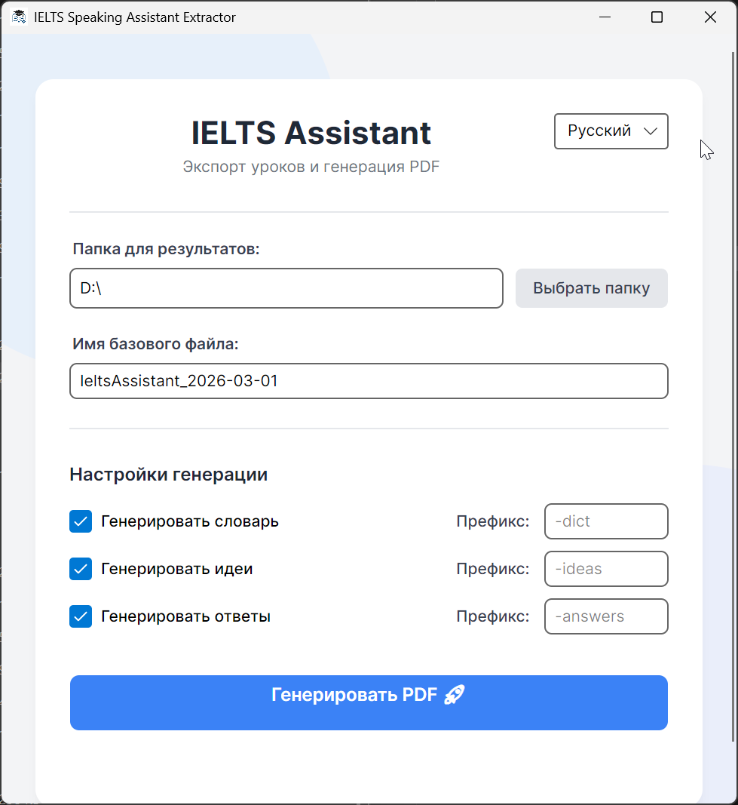
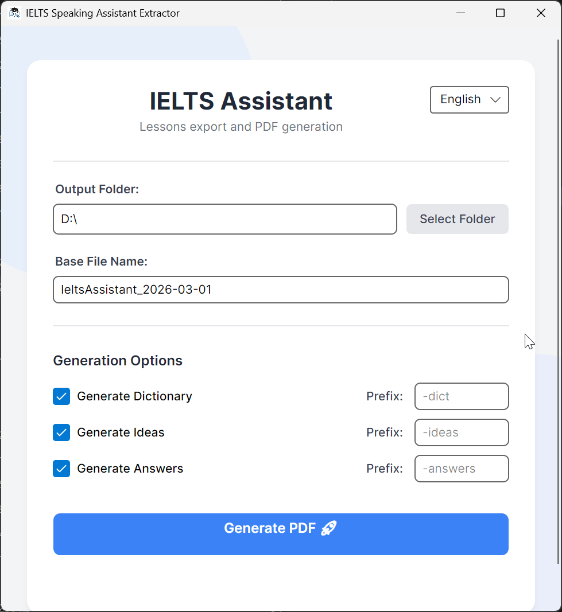

# IELTS Speaking Assistant PDF Extractor

A fast, lightweight, and modern Avalonia `.NET 10` desktop application designed to interact with the IELTS Speaking API, format the results, and automatically generate beautifully bookmarked PDF study materials.





## Features

- **Automated Data Retrieval:** Dynamically fetches up-to-date Sections 1, 2, and 3 content from the IELTS API.
- **Rich PDF Generation:** Uses the powerful `QuestPDF` library to compose professional-level layouts alongside dictionaries, answers, and ideas.
- **Smart Bookmarks & Navigation:** Features built-in integration with `iText7` to meticulously scan the PDF and create precise Word-Boundary outlines (bookmarks) mapping all topics, ensuring immediate navigation to exact page destinations.
- **Command-Line Interface (CLI):** Fully supports headless automation. You can fire up generation straight from scripts or Windows Task Scheduler without showing a GUI!
- **Sleek Graphics (GUI):** A clean, minimalist UI built on Avalonia, providing one-click PDF generation and folder tracking.

---

## 🚀 Getting Started

### Prerequisites

- [.NET 10.0 SDK](https://dotnet.microsoft.com/download)

### Build & Run

Clone the repository and jump into the terminal:

```bash
git clone https://github.com/KukushIvan/IeltsSpeakingAssistantExtractor.git
cd IeltsSpeakingAssistantExtractor/IeltsSpeakingAssistantExtractor

# Build & Run Graphical Interface
dotnet run
```

---

## 💻 CLI (Headless) Mode

Automate document generation by triggering the executable directly from the command line:

```cmd
IeltsSpeakingAssistantExtractor.exe --cli "C:\Path\To\Your\Output\Folder"
```

- When triggered, it will immediately begin generating.
- If you don't supply a folder path, it will fall back to a local `Results` directory inside the executable's folder.
- Terminal outputs detailed generation progress and exception logs.

---

## ⚙️ Configuration

The UI persists your preferences automatically in your `AppData` directory:

- Custom prefixes for file names (e.g., `-dict-answers-ideas`)
- Checkboxes to toggle Dictionaries, Answers, or Ideas on/off

## 🛡️ GitHub Actions Support

This project includes an automated GitHub Actions CI pipeline (`.github/workflows/build.yml`) that builds and packages a single self-contained Windows `x64` executable artifact automatically whenever a new `v*` release tag is pushed!
